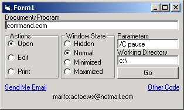



## Add hyperlinks & open files with their associated program

### Description

This module will enable you to run a program, or open a file in its associated app with one command. It also allows you to add web or email hyperlinks just as easily. See the sample form for examples.
 
### More Info
 
filename or url, and optionally additional parameters, window settings, or action type (Open, Edit, Print...)

True if command was run, false if it wasn't

             |
---                |---
**Submitted On**   |2001-06-27 14:26:50
**By**             |[Alan Toews](https://github.com/Planet-Source-Code/PSCIndex/blob/master/ByAuthor/alan-toews.md)
**Level**          |Beginner
**User Rating**    |4.8 (53 globes from 11 users)
**Compatibility**  |VB 5\.0, VB 6\.0
**Category**       |[Miscellaneous](https://github.com/Planet-Source-Code/PSCIndex/blob/master/ByCategory/miscellaneous__1-1.md)
**World**          |[Visual Basic](https://github.com/Planet-Source-Code/PSCIndex/blob/master/ByWorld/visual-basic.md)
**Archive File**   |[Add hyperl218156272001\.zip](https://github.com/Planet-Source-Code/alan-toews-add-hyperlinks-open-files-with-their-associated-program__1-24509/archive/master.zip)

